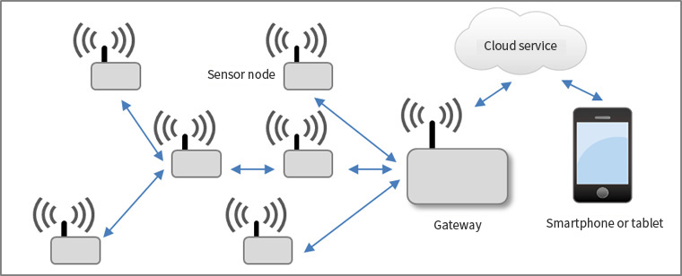

#  Embedded Systems - Wireless Sensor Networks

  

Final assignment for the Embedded Systems course, at **Universidad Nacional del Sur**.

### Description
This project is about controlling 3 Mrf24j40MB module (802.15.4 radio) that are connected to the SPI hardware interface of 2 Arduino and a Raspberry PI. We used the arduinos as the leaf nodes of the network to sense values and send it to the coordinator node (Raspberry). This one is connected to the internet and retransmit the values to a database, in this case Firebase. Finally we show the information on a web dashboard. We also allow to send commands from the web page, like turn on/off or a value, to any nodes in the network.

### Team
* Fassi Jeremias
* Salazar Gisbert Gabriel

### Technologies
* Mrf24j40MB (802.15.4 module)
* Raspberry Pi 3 B
* Arduino Uno
* Firebase
* Angular 7

### Sources and Acknowledgements
* Arduino driver for the mrf24j40 802.15.4 modules [GitHub](https://github.com/karlp/Mrf24j40-arduino-library).
* <a href="http://wiringpi.com/">WiringPi</a>, a PIN based GPIO access library written in C for Raspberry PI.
* WiringPi-Python, Unofficial Python-wrapped version of Gordon Henderson's WiringPi version 2 [GitHub](https://github.com/WiringPi/WiringPi-Python).
* Pyrebase, a simple python wrapper for the Firebase API [GitHub](https://github.com/thisbejim/Pyrebase).
* Big thanks to <a href="https://www.akveo.com">Akveo</a> for their great admin dashboard template [GitHub](https://github.com/akveo/ngx-admin)
